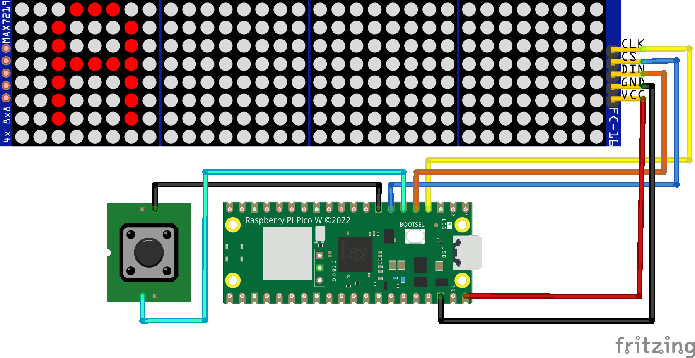

# DIY On-Air-Display controlled by a REST-API

This is the repository for a DIY on-air-display using a [MAX7219 8x32 LED matrix](https://www.amazon.de/Youmile-Control-LED-Anzeigemodul-Arduino-Raspberry/dp/B099F2MN15) controlled by a [Raspberry Pico W](https://www.raspberrypi.com/products/raspberry-pi-pico/) running a [micropython](https://micropython.org/) REST-API using [Microdot](https://microdot.readthedocs.io/en/latest/).


## Setup

### Parts

* [MAX7219 8x32 LED matrix](https://www.amazon.de/Youmile-Control-LED-Anzeigemodul-Arduino-Raspberry/dp/B099F2MN15)
* [Raspberry Pico W](https://www.raspberrypi.com/products/raspberry-pi-pico/)
* [Push-Button](https://www.amazon.de/dp/B081TV622R?smid=AT0FJ7CZCB0G9)
* 5V Micro-USB power-source or USB cable
* Wires
* [Casing](#casing)

### Wiring



### Casing

I created a [simple 3d printed case](https://cad.onshape.com/documents/71781608140f03a0c4abf547/w/2687a64c73f126bf467bbb62/e/b8791e3240e13732a7194e4d?renderMode=0&uiState=6714c241a4be4f75c8428074) using [OnShape](https://www.onshape.com) you can use and change to your desired needs. By default it fits the display, RPi and the button meantioned above and you can mount it to the wall. I used a [3mm translucent white acrylic glas](https://www.amazon.de/dp/B09J3SW25R) to cover the front, but this is oc optional and has only an aesthetic purpose.

## Configuration

Make a copy of `config.sample.json`, name it `config.json` and apply your configs, like your WiFi credentials etc. .

Flash your Raspberry Pi Zero W with the [latest Micropython](https://micropython.org/download/RPI_PICO_W/) version (instructions on page).

Upload all files to the root folder of the Raspberry Pi Zero W.

After that you can unmount your Pi and plug it into a suitable power-source. The device should power-up instantly and show its state on the display until it is connected.

When it is connected the display initially shows the given IP address. But you should also be able to use the hostname set in the configs (default: `http://on-air-bulb`).

Now the device is running and accessible via it's [API](#api-docs) and the button.

## API Docs

<details>
   <summary>
      <code>GET</code> <code>/on</code> Turn the default image on
   </summary>

   #### Parameters
   > None

   #### Responses
   > | http-code | content-type | response |
   > | --------- | ------------ | -------- |
   > | `200` | `application/json; charset=UTF-8` | JSON |

   ##### Example cURL
   > ```bash
   >  curl -X GET http://192.168.0.111/on
   > ```
</details>

<details>
   <summary>
      <code>GET</code> <code>/on/:text</code> Turn any text value on
   </summary>

   #### Parameters
   > | name | type | data-type | description |
   > | ---- | ---- | --------- | ----------- |
   > | `text` | required | string (url-encoded) | the text-string you want to display, if it is longer than 4 letters it will scroll back and forth |

   #### Responses
   > | http-code | content-type | response |
   > | --------- | ------------ | -------- |
   > | `200` | `application/json; charset=UTF-8` | `{"success": true, "state": 1}` |

   ##### Example cURL
   > ```bash
   >  curl -X GET http://192.168.0.111/on/Hello%20World
   > ```
</details>

<details>
   <summary>
      <code>GET</code> <code>/off</code> Turn the display off
   </summary>

   #### Parameters
   > None

   #### Responses
   > | http-code | content-type | response |
   > | --------- | ------------ | -------- |
   > | `200` | `application/json; charset=UTF-8` | `{"success": true, "state": 0}` |

   ##### Example cURL
   > ```bash
   >  curl -X GET http://192.168.0.111/off
   > ```
</details>

<details>
   <summary>
      <code>GET</code> <code>/toggle</code> Toggle the default image
   </summary>

   #### Parameters
   > None

   #### Responses
   > | http-code | content-type | response |
   > | --------- | ------------ | -------- |
   > | `200` | `application/json; charset=UTF-8` | `{"success": true, "state": 1}` |

   ##### Example cURL
   > ```bash
   >  curl -X GET http://192.168.0.111/toggle
   > ```
</details>

<details>
   <summary>
      <code>GET</code> <code>/toggle/:text</code> Toggle any text value
   </summary>

   #### Parameters
   > | name | type | data-type | description |
   > | ---- | ---- | --------- | ----------- |
   > | `text` | required | string (url-encoded) | the text-string you want to display, if it is longer than 4 letters it will scroll back and forth |

   #### Responses
   > | http-code | content-type | response |
   > | --------- | ------------ | -------- |
   > | `200` | `application/json; charset=UTF-8` | `{"success": true, "state": 1}` |

   ##### Example cURL
   > ```bash
   >  curl -X GET http://192.168.0.111/toggle/hallo%20welt
   > ```
</details>

<details>
   <summary>
      <code>GET</code> <code>/brightness/:value</code> Set the brightness of the display
   </summary>

   #### Parameters
   > | name | type | data-type | description |
   > | ---- | ---- | --------- | ----------- |
   > | `brightness` | required | int | set it to a value between `1` and `15`, default: `1` |

   #### Responses
   > | http-code | content-type | response |
   > | --------- | ------------ | -------- |
   > | `200` | `application/json; charset=UTF-8` | JSON |

   ##### Example cURL
   > ```bash
   >  curl -X GET http://192.168.0.111/brightness/5
   > ```
</details>

<details>
   <summary>
      <code>GET</code> <code>/brightness</code> Reset the brightness value
   </summary>

   #### Parameters
   > None

   #### Responses
   > | http-code | content-type | response |
   > | --------- | ------------ | -------- |
   > | `200` | `application/json; charset=UTF-8` | `{"success": true, "state": 1}` |

   ##### Example cURL
   > ```bash
   >  curl -X GET http://192.168.0.111/brightness
   > ```
</details>

## Apple Shortcut

I made [*this small shortcut*](https://www.icloud.com/shortcuts/6cb9b6efc35a46379dafb8790af98a7c) using the [Shortcut feature of MacOS and iOS](https://support.apple.com/guide/shortcuts/welcome/ios) – this way you can easily call it from any widget and/or from your home-screen. You can change the target URL if needed, by default it is the hostname set in the `configs.json` (Default: `on-air-bulb`).

## Create a custom image (transform image into `byte_array`)

By default the `byte_array` representations of the `image-0.png` and `image-1.png` in the root folder in `src/image.py` is displayed after another in an short interval (blinking animation).

To create a custom images follow these steps:

1. install `pillow` library (image-library):
   ```bash
   pip3 install pillow
   ```
1. create your monochrome (black and white, with a background) PNG images in the dimensions of 8x32px and replace the `image-0.png` and `image-1.png` in the root folder
1. run the `image2bytearray` script in the `/scripts` folder:
   ```bash
   python3 scripts/image2bytearray.py
   ```
1. the `src/image.py` should now be updated with the `byte_array` representation of your image

---

## License

This project is licensed under the [GNU General Public License v3.0](LICENSE).
